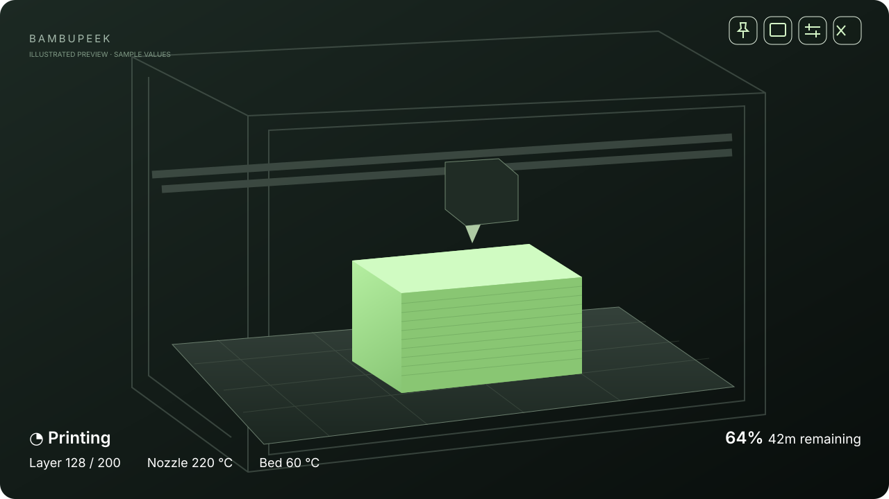
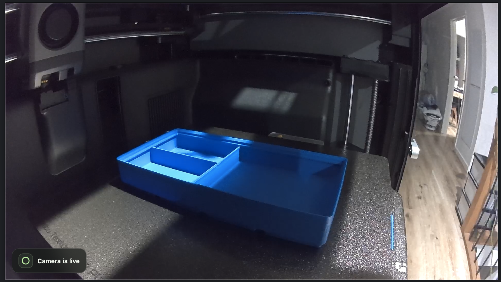

<div align="center">
  
  <h1>BambuPeek</h1>
  <p><strong>Your printer. In view.</strong></p>
  <p>A quiet, floating window for your Bambu printer’s camera and print status.</p>
  <p><a href="#install">Install</a> · <a href="docs/setup.md">Printer setup</a> · <a href="docs/troubleshooting.md">Troubleshooting</a> · <a href="docs/privacy.md">Privacy</a> · <a href="CONTRIBUTING.md">Contribute</a></p>
</div>



*Illustration with sample values.*

<details>
<summary>See a real P2S camera example</summary>



*Camera example shared with permission. This capture shows an earlier development overlay; the current app uses the white text layout illustrated above. No connection details are shown.*

</details>

BambuPeek keeps the camera in view while you work. There is no title bar or dashboard to get in the way: controls appear over the picture, and print status stays readable as white text along the bottom.

- **Live camera:** H.264 video received directly from the printer over your local network.
- **Print status:** progress, time remaining, layer count, nozzle and bed temperatures.
- **Stay on top:** pin the window above your other apps; press Escape to unpin.
- **Three sizes:** Small (480 × 270), Medium (800 × 450), and Large (1120 × 630). The selection is remembered.
- **Save once:** store one printer in the device’s secure credential store and reconnect on launch.
- **Local discovery:** find compatible printers without typing their IP address or serial number.
- **No BambuPeek account, telemetry, cloud relay, or recording.**

## Status and compatibility

**Early preview, version 0.1.0.** Camera and status have been tested with a Bambu Lab P2S on an Apple Silicon Mac. This is an independent community project, not affiliated with or endorsed by Bambu Lab.

| Platform / printer | Current status |
| --- | --- |
| macOS on Apple Silicon | Downloadable preview; live camera and status tested |
| Intel Mac | Source build only; unverified |
| Windows | Source is experimental; no installer or hardware validation yet |
| Linux | Unsupported; secure saving is explicitly unavailable |
| P2S | Tested with LAN Only Liveview enabled |
| Other Bambu models | Unverified; printers using the separate JPEG camera protocol are not supported |

The camera requires an H.264 RTSPS stream on port 322. Status uses MQTT over TLS on port 8883. Firmware and network configuration can affect availability. This preview is **not Apple notarized or Developer ID signed**. Read the [first-launch instructions](docs/setup.md#first-launch-on-macos) before installing. The app targets macOS 12; playback requires a WebKit version with MediaSource and video frame callbacks, so use an up-to-date macOS installation. Older macOS versions have not been tested.

## Install

### Homebrew — Apple Silicon

```sh
brew tap Fahim8371/bambupeek
brew install --cask bambupeek
```

The [project tap](https://github.com/Fahim8371/homebrew-bambupeek) installs BambuPeek and its external FFmpeg dependency. It is a third-party tap, separate from Homebrew’s official cask collection. Open **BambuPeek** from Applications.

To update:

```sh
brew update
brew upgrade --cask bambupeek
```

### Download the app

Get **BambuPeek-0.1.0-macos-arm64.zip** from [GitHub Releases](https://github.com/Fahim8371/bambupeek/releases). Unzip it, move BambuPeek to Applications, and install the video engine:

```sh
brew install ffmpeg
```

FFmpeg is not bundled. BambuPeek checks the app’s executable directory, standard Homebrew locations, and PATH. The release includes a SHA-256 checksum file so you can verify the download.

### Clone with Git and build

Install [Tauri’s platform prerequisites](https://v2.tauri.app/start/prerequisites/), a current Rust toolchain, Node.js 22.12 or newer, and FFmpeg. On macOS, the prerequisites include Xcode Command Line Tools.

```sh
git clone https://github.com/Fahim8371/bambupeek.git
cd bambupeek
npm ci
npm run tauri build -- --bundles app
```

The macOS app is written to `src-tauri/target/release/bundle/macos/BambuPeek.app`. For development with live reload, run `npm run tauri dev` instead. Git downloads the source; the build step creates the app.

## Connect your printer

1. Put the computer and printer on the same trusted local network.
2. On P2S, enable **LAN Only Liveview** in its LAN settings. You can keep cloud printing enabled.
3. Open BambuPeek and choose **Connect a printer**.
4. Choose **Find printers on this network**, or enter the printer’s local IPv4 address.
5. Enter the printer’s eight-character **LAN access code**. Discovery fills the serial number; you can also add it under **Print status**.
6. Leave **Save this printer on this device** selected to reconnect automatically next time. Open the live view.
7. Allow BambuPeek’s Local Network access when macOS asks.

Saving happens after the first video frame successfully appears. A failed connection does not replace the saved printer. For a session-only connection, uncheck Save; an existing saved printer remains until you choose **Forget**. See [the full setup guide](docs/setup.md).

## Window controls

Move the pointer over the video to reveal the controls at the top right. They fade when idle and remain accessible using Tab.

| Control | Action |
| --- | --- |
| Move | Drag the handle, or drag anywhere on the video |
| Pin | Toggle Stay on top; Escape turns it off |
| Size | Choose Small, Medium, or Large |
| Settings | Connect, save the current printer, reconnect a saved printer, or forget it |
| Minimize / Close | Standard window actions |

The status overlay has no panel or background. If status disconnects after receiving data, values are marked as the last received values while the connection retries. Camera interruptions show a retry screen rather than presenting a frozen image as live.

## Where your details go

The saved printer’s IP, LAN access code, and optional serial number are stored together in **macOS Keychain** (or Windows Credential Manager in experimental source builds). They are not written to a JSON settings file, repository, or release. The app does not sync them to a BambuPeek service. The operating system’s backup and credential policies still apply.

Only size and pin preferences are kept in local webview storage. The access code is cleared from the form after connection and is never returned from the secure store to the interface. Choose **Forget** in settings to remove the saved credential. Quitting clears the active in-memory connection; uninstalling the app alone may leave its saved credential. [Read the storage and network details](docs/privacy.md).

## Development and support

```sh
npm run build
npm test
npm run check:privacy
```

Read the [architecture](docs/architecture.md), [contribution guide](CONTRIBUTING.md), and [release guide](docs/releasing.md). For connection problems, start with [troubleshooting](docs/troubleshooting.md).

When opening an issue, include the app version, macOS version, printer model, and a description of the failure. **Do not include access codes, serial numbers, network addresses, raw FFmpeg/MQTT logs, or identifiable camera images.**

## License

[MIT](LICENSE). FFmpeg is installed separately and has its own [licensing terms](https://ffmpeg.org/legal.html). Dependencies retain their respective licenses.
