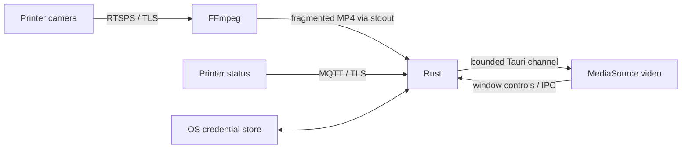

# Architecture

BambuPeek uses Tauri 2 for a native window and IPC, Rust for printer connections and secure storage, and TypeScript with the system webview for video and controls. No localhost media server or cloud relay is involved.

## Source map

| File | Responsibility |
| --- | --- |
| `src/main.ts` | MediaSource lifecycle, frame presentation checks, UI, settings and window presets |
| `src/styles.css` / `index.html` | Frameless viewer, white status overlay, accessible controls and setup form |
| `src-tauri/src/main.rs` | Validated connection input, session ownership and IPC commands |
| `camera.rs` | FFmpeg process, stdin manifest, fMP4 output, codec extraction and safe errors |
| `status.rs` | TLS MQTT connection, selected status fields, partial report merging and retries |
| `discovery.rs` | Local UDP discovery and validated printer metadata |
| `storage.rs` | Versioned profile in native credential store; sanitized public metadata |

## Playback

FFmpeg copies the incoming H.264 stream into fragmented MP4 without transcoding. Rust reads bounded chunks and sends binary data through Tauri channels. A 12-credit semaphore limits in-flight chunks; the frontend acknowledges completed SourceBuffer appends. The frontend also limits its queue to 8 MiB and trims old media data.

The codec string comes from the actual MP4 `avcC` record. The interface reports Live only after the video element presents a frame. Startup and playback watchdogs catch connection and decoding stalls. Stopping a session aborts its owned tasks and kills the FFmpeg child; session IDs prevent old callbacks or acknowledgements affecting a replacement connection.

## Status

MQTT uses a separate task. It subscribes to the device report topic before requesting a snapshot, accepts larger printer reports, and merges partial updates without erasing previous fields. Only progress, state, time, layers and temperatures are sent to the frontend. A disconnected status path does not stop the camera.

## Persistence

A versioned JSON representation is stored *inside* the native credential store, never on disk as a config file. Native operations run on blocking worker threads and are serialized. Public metadata has a separate type containing only IP and serial; loading a profile seeds Rust’s connection memory without returning its access code over IPC.

The app remembers one printer. A new profile is saved only after successful frame presentation, or via an explicit save of the live session. A session ID check prevents a stale frontend save request from selecting a different session’s credentials. The frontend serializes save/forget interactions. Unsupported credential backends fail explicitly instead of silently using an in-memory mock.

## Scope

There are no printer control operations, cloud APIs, saved video, auto-updater, multi-printer library, or JPEG camera protocol. Windows source support is experimental. These are possible future additions, not current features.
